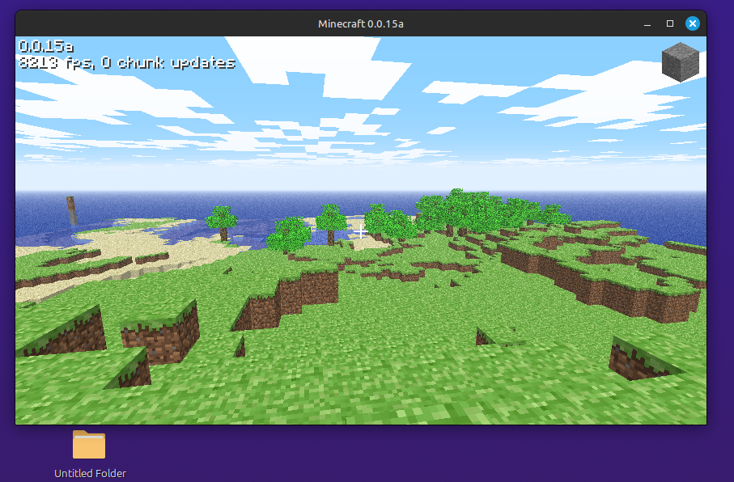

# MineCPP 
###### Literally useless

Useless Minecraft rewrite from Java to C++. Trying to be as close as possible.
This is done by copy pasting code from Java classes and just removing stuff.

## Any good from this?
Uhh i noticed ~15% better framerate wow wohoo.
As of rd-132328 ~1350 fps on the actual version and ~1550 on this one.

On 0.0.15a, Small and Normal worlds have a lot better performance.
As for Huge worlds, it's basically the same as Java

